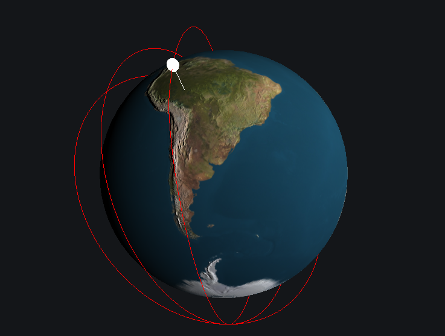

# MapTrack3D

A plugin for Grafana that visualizes GPS points on a 3D globe. A marker shows the position at the time when hovering over other panels on the dashboard.



## Configuration

The plugin requires latitude,longitude, and optionally altitude measurements provided as floats in two/three separate fields
formatted by Grafana as a "Time series".

It can be used with MySQL/MariaDB as a data source by using a querie along the lines of:

```
SELECT
    "timestamp" as time,
    lat,
    lon,
    alt,
FROM test_data
WHERE $__timeFilter(timestamp)
ORDER BY timestamp ASC
```

A demo CSV file that can be used in conjunction with [CSV datasource](https://grafana.com/grafana/plugins/marcusolsson-csv-datasource/) is provided [here](https://raw.githubusercontent.com/flaminggoat/map-track-3-d/master/testdata/iss.csv)


## How to develop
If you don’t want to install Grafana on your local machine, you can use Docker.

To set up Grafana for plugin development using Docker, run the following command:

```
docker run -d -p 3000:3000 -v "$(pwd)"/dist:/var/lib/grafana/plugins --name=grafana grafana/grafana:7.4.3
```

Since Grafana only loads plugins on start-up, you need to restart the container whenever you add or remove a plugin.

```
docker restart grafana
```

## Attributions
Icon made by [Freepik](https://www.flaticon.com/authors/freepik) from [Flaticon](https://www.flaticon.com/)

Map Texture from [Planet Pixel Emporium](http://planetpixelemporium.com) Copyright (c) James Hastings-Trew